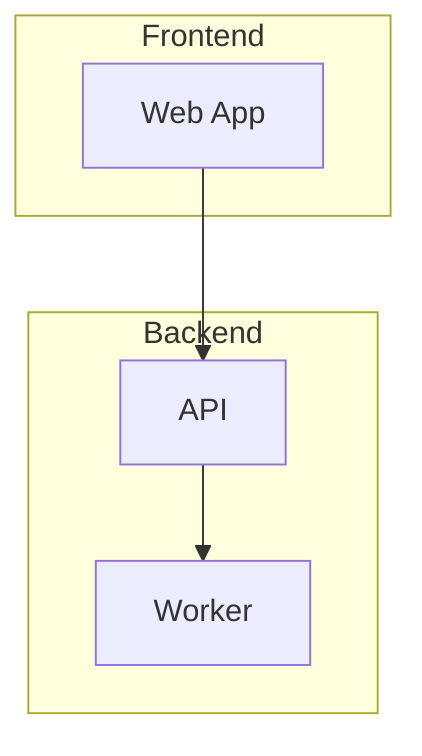
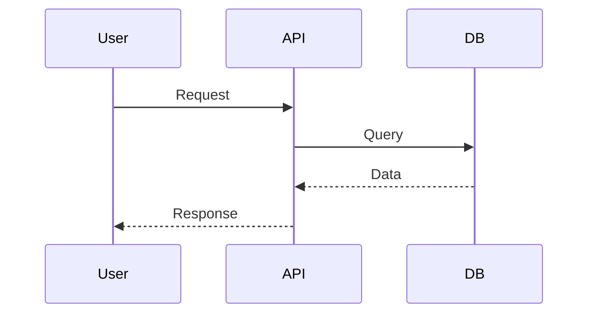
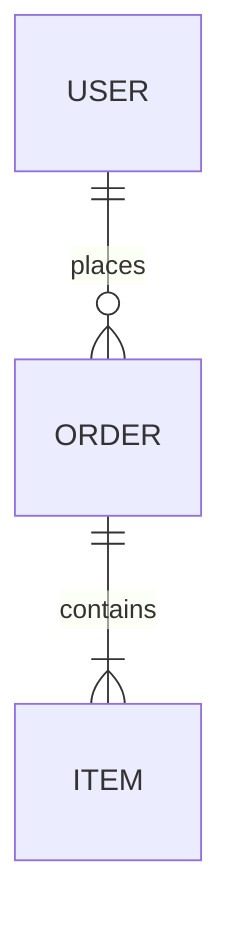

# Guilty Spark

> "I am 343 Guilty Spark, the Monitor of Installation 04."

Branch-aware documentation management for Claude Code projects. Guilty Spark maintains living documentation that tracks features, architecture, and design decisions with intelligent branch detection.

## Philosophy

- **Code as source of truth** - Documentation references and validates against actual code
- **Branch-aware** - Checkpoint command adapts behavior based on git branch
- **User in control** - Documentation happens when you ask, not automatically
- **Atomic commits** - Documentation commits are separate from code commits
- **Current state only** - Git history is the changelog; docs show what exists now
- **Visual documentation** - Mermaid diagrams for architecture and data flows

## Installation

```bash
/plugin install guilty-spark@quickstop
```

## Documentation Structure

Guilty Spark maintains documentation in `docs/`:

```
docs/
├── README.md             # Main entry point (auto-rendered by GitHub)
├── architecture/
│   ├── OVERVIEW.md       # System design + key decisions
│   └── components/       # Component documentation
└── features/
    ├── README.md         # Feature inventory (auto-rendered by GitHub)
    └── [feature-name]/   # Per-feature documentation
```

## How It Works

### The Monitor Skill

Ask Claude directly for documentation help:

- "Document this feature" → Dispatches Sentinel-Feature
- "Update architecture docs" → Dispatches Sentinel-Architecture
- "How does X work?" → Dispatches Sentinel-Research for deep analysis
- "What's documented?" → Navigates existing documentation

### Branch-Aware Checkpoint

Use `/guilty-spark:checkpoint` for intelligent documentation capture:

**On Feature Branches:**
```
/guilty-spark:checkpoint
       ↓
  Analyzes git diff against main
       ↓
  Dispatches sentinel-diff
       ↓
  Documents only the changes
```

**On Main Branch:**
```
/guilty-spark:checkpoint
       ↓
  Performs comprehensive audit
       ↓
  Cross-references code vs docs
       ↓
  Dispatches sentinels for gaps
```

### Mermaid Diagrams

Guilty Spark generates mermaid diagrams for visual documentation:

**Architecture Overview:**


**Data Flow:**


**Data Models:**


### Sentinels

Sentinels are autonomous agents that maintain documentation:

| Sentinel | Purpose |
|----------|---------|
| **Sentinel-Feature** | Documents features, updates feature index |
| **Sentinel-Architecture** | Analyzes and documents system design |
| **Sentinel-Diff** | Documents changes specific to a feature branch |
| **Sentinel-Index** | Keeps README.md files current |
| **Sentinel-Research** | Deep codebase research for questions |

Sentinels run in the background so you can continue working.

## Command

| Command | Description |
|---------|-------------|
| `/guilty-spark:checkpoint` | Branch-aware documentation capture |

## Atomic Commits

Documentation is always committed separately from code:

- Sentinels check for staged code changes before committing
- If code is staged, docs changes wait (you commit when ready)
- Commit messages use `docs(spark):` prefix

Example commit:
```
docs(spark): Document authentication feature
```

## Best Practices

1. **Use checkpoints** - Run `/guilty-spark:checkpoint` before `/clear` or ending your session
2. **Trust the branch detection** - Feature branches get diff-focused docs, main gets comprehensive review
3. **Trust the Sentinels** - They validate code references and keep docs current
4. **Review the diagrams** - Mermaid diagrams render in GitHub and most markdown viewers

## Requirements

- Git repository (documentation is tracked and committed)
- Claude Code with plugin support

## The Halo Theme

| Halo Concept | Plugin Component |
|--------------|------------------|
| **343 Guilty Spark** | The Monitor skill |
| **The Library** | `docs/` folder |
| **Sentinels** | Autonomous agents |
| **Containment** | Atomic commits |

## v3.0.0 Changes

This version simplifies the plugin and adds branch-aware intelligence:

- **Added**: Branch-aware checkpoint command (diff mode vs deep review mode)
- **Added**: Sentinel-Diff agent for feature branch documentation
- **Added**: Mermaid diagram generation in all documentation
- **Added**: Documentation initialization in Monitor skill
- **Removed**: SessionStart hook (docs init moved to Monitor skill)
- **Removed**: Pre-commit reminder hook
- **Removed**: `/guilty-spark:doctor` command
- **Changed**: From "proactive suggestions" to "explicit user control"

## License

MIT
