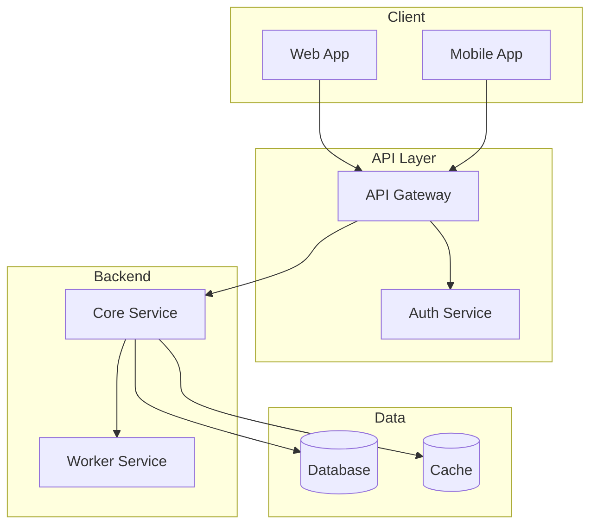
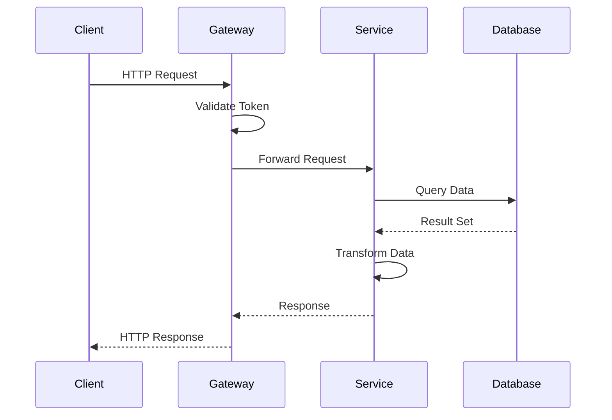
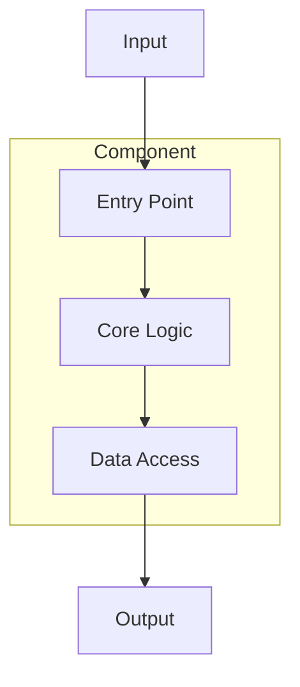

# Architecture Documentation Template

Use this template for architecture documentation. Sentinels reference this for consistency.

## OVERVIEW.md Template

```markdown
# Architecture Overview

> Project: [Project Name]

## System Design

Brief description of the overall system architecture (3-5 sentences).

### High-Level Diagram



## Technology Stack

| Layer | Technology | Purpose |
|-------|------------|---------|
| Frontend | React/Vue/etc | User interface |
| Backend | Node/Python/etc | API and business logic |
| Database | Postgres/etc | Data persistence |

## Key Architectural Decisions

| Decision | Rationale | Trade-offs | Date |
|----------|-----------|------------|------|
| Using X over Y | Brief explanation | What we gave up | YYYY-MM-DD |

## Directory Structure

```
project/
├── src/           # Description
│   ├── components/
│   └── services/
├── tests/         # Description
└── config/        # Description
```

## Data Flow

### Request Lifecycle



## Integration Points

| System | Protocol | Purpose |
|--------|----------|---------|
| External API | REST/GraphQL | What it's for |
```

## Component Documentation Template

For `architecture/components/[component].md`:

```markdown
# [Component Name]

> Part of: [Parent System/Module]

## Purpose

What this component does and why it exists.

## Architecture



## Implementation

**Main files:**
- `path/to/main-file.ts` - Entry point
- `path/to/helpers.ts` - Support functions

## Decisions

| Decision | Why | Alternatives Considered |
|----------|-----|------------------------|
| Chose X | Reason | Y, Z |

## Dependencies

- **Requires:** Components this depends on
- **Used by:** Components that depend on this

## API Surface

If applicable, document the public interface.
```

## Writing Guidelines

1. **Focus on "why"** - Decisions and rationale matter more than "what"
2. **Keep current** - Only document the current state
3. **Reference code** - Include file paths for key implementations
4. **Avoid duplication** - Link to component docs instead of repeating
5. **Use mermaid diagrams** - Preferred over ASCII art for maintainability and rendering

## Diagram Guidelines

### System Overview
Use `flowchart TD` with subgraphs to show major system components and their relationships.

### Data Flow
Use `sequenceDiagram` to show how requests flow through the system.

### Component Relationships
Use `flowchart` to show internal structure of complex components.

### Data Models
Use `erDiagram` to show entity relationships in the data layer.
