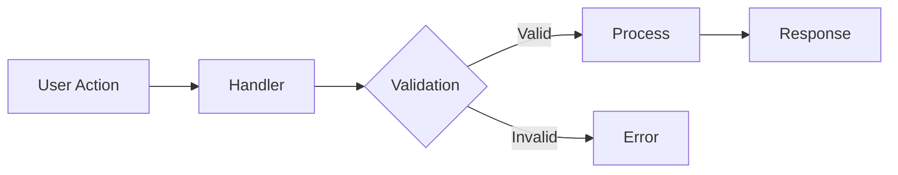
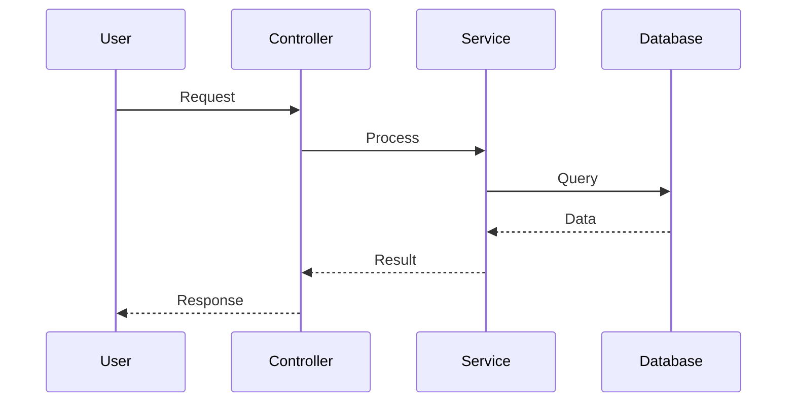
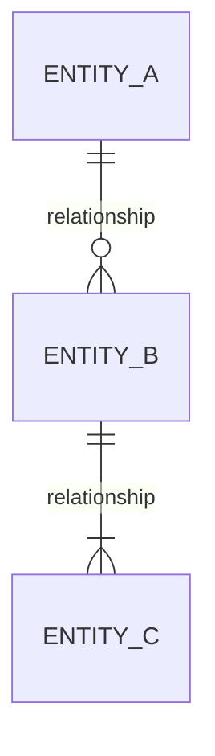

# Feature Documentation Template

Use this template when documenting features. The Sentinels use this structure for consistency.

## Template Structure

```markdown
# [Feature Name]

> Brief one-line description of what this feature does

## Overview

2-3 sentences explaining the feature's purpose and value.

## Implementation

### Entry Points

List the main entry points for this feature:
- `path/to/file.ts:lineNumber` - Brief description

### Key Components

| Component | File | Purpose |
|-----------|------|---------|
| ComponentName | `path/to/file.ts` | What it does |

### Data Flow

Brief description of how data flows through the feature:
1. User triggers X
2. Component A handles it
3. Data flows to B
4. Result is returned/displayed

## Diagrams

Include mermaid diagrams where helpful. Choose the appropriate type:

### Flow Diagram (for process/data flow)



### Sequence Diagram (for multi-component interactions)



### ERD (for data relationships)



## Configuration

If applicable, list configuration options:
| Option | Type | Default | Description |
|--------|------|---------|-------------|

## Dependencies

- **Internal:** List internal dependencies
- **External:** List external packages/libraries

## Related Features

Links to related feature documentation.
```

## Writing Guidelines

1. **Code references are mandatory** - Always include file:line references
2. **Current state only** - Don't document history; git has that
3. **Validate references** - Ensure referenced code actually exists
4. **Keep it brief** - 1-2 pages max per feature
5. **Use tables** - For lists of components, options, etc.
6. **Include diagrams** - Use mermaid for complex flows or relationships

## When to Include Diagrams

- **Always**: Features with more than 3 components in the data flow
- **Always**: Features involving multiple services or APIs
- **Optional**: Simple CRUD features with straightforward flow
- **Always**: Features with complex state or decision logic
